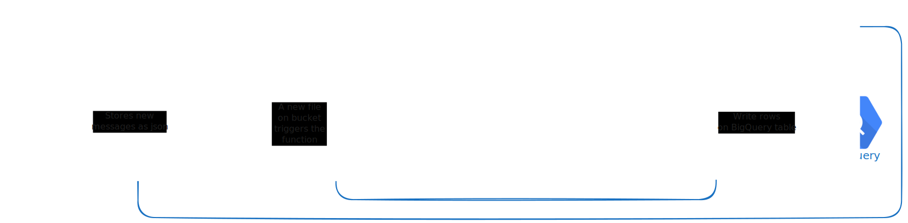

# google-cloud-run-function-parse-email

A Google Cloud Run Function service app to execute each time a new email is uploaded to a bucket



## How it works?

Each time a new email is uploaded to the associated bucket, the function is triggered. The function receives the email as a json file containing the email headers and body.

The function parses the email and extracts contents from the email body and writes the extracted contents to a table in Google BigQuery.

### How the email gets to the bucket?

The email gets to the bucket through a app that watchs for new emails and if the email matches one or multiple classfiers, the email is uploaded to the bucket. The process is automated and you can check it on the following repository: [Gmail Automation](https://github.com/03felipesampaio/gmail-automation)


### How the function nows which parser to use?

By the path of the file. Once you write the file to the bucket, you specify the path. Then go to src/main.py and create a new filter

Ex.: 
 * Create a file with path 'Uber/Receips/{email_id}.json'
 * Add a new filter to the main.py file: 
 ```python
    if filename.startswith("Uber/Recibos/") and filename.endswith(".json"):
        content = parse_uber_receipts(email)
 ```
 * Then write the code to parse the email using BeautifulSoup or any other library you want

## How to deploy?

You need to have the Google Cloud SDK installed and configured. Then you can run the following command:

```bash
chmod +x deploy.sh

./deploy.sh
```